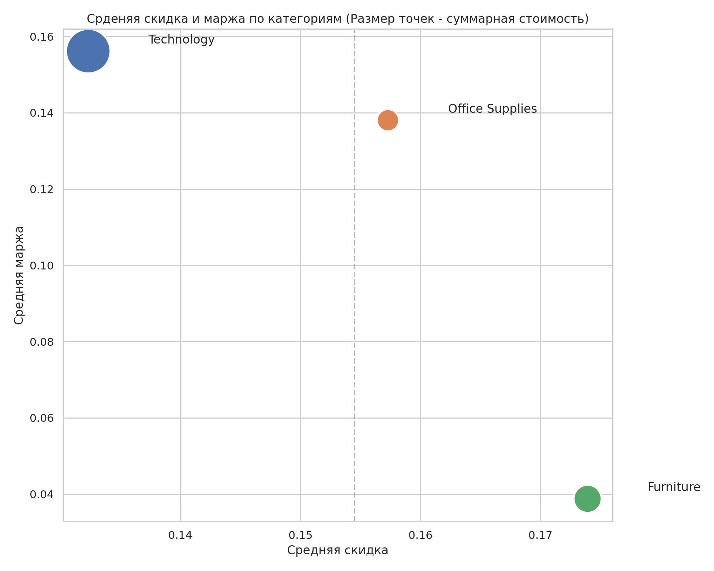
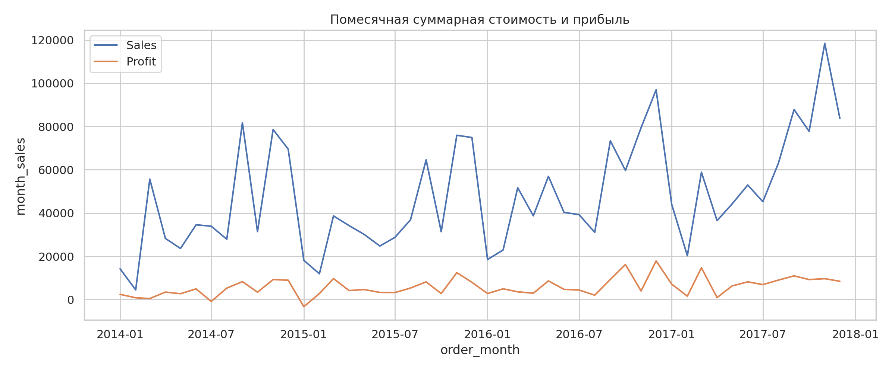
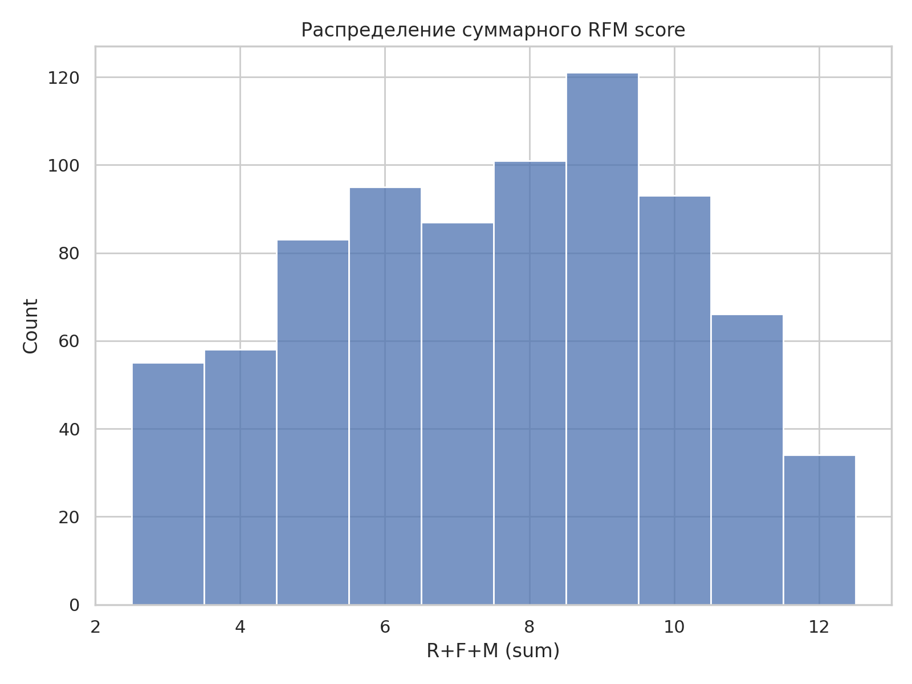
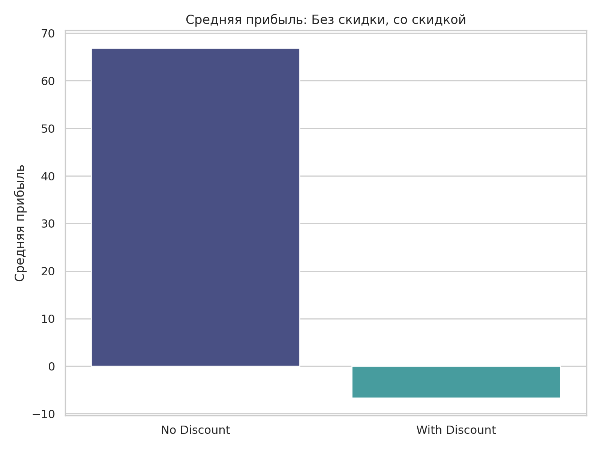
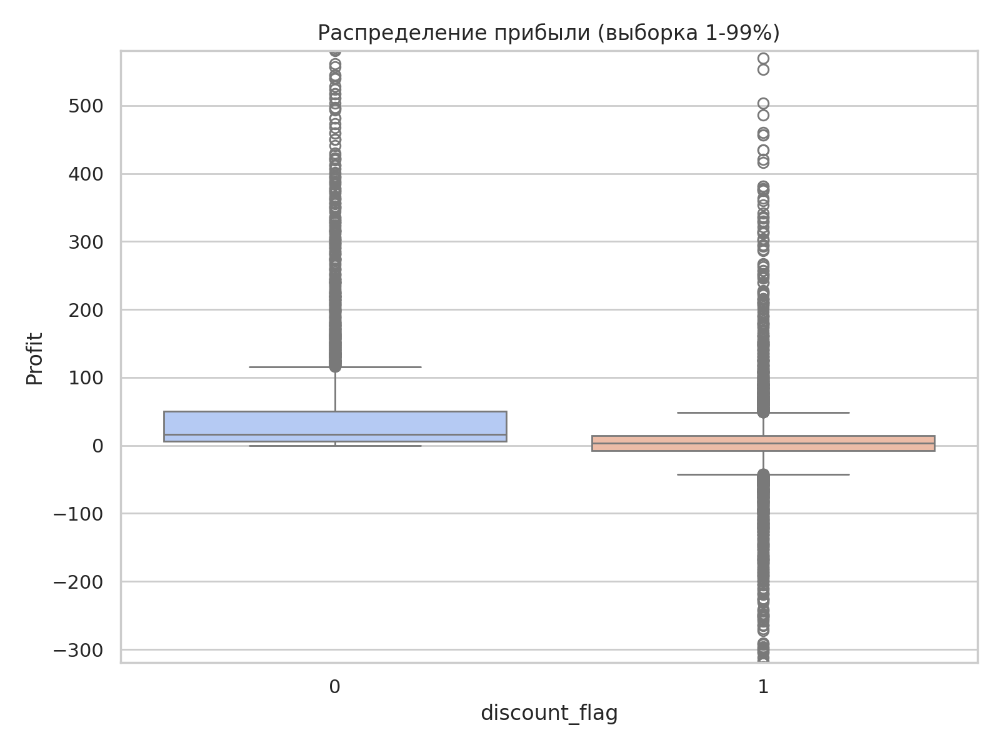

# Superstore Marketing Analysis

## Цель проекта:
- Провести маркетинговый анализ продаж (категории, сезонность, KPI).
- Выполнить RFM-анализ для сегментации клиентов.
- Провести A/B-тест по влиянию скидок на прибыль.

Основные задачи:
- Анализ структуры и динамики продаж;
- Определение ключевых категорий и продуктов по прибыли;
- Анализ сезонности;
- Проведение RFM-анализа клиентов;
- Проверка гипотезы о влиянии скидок (A/B-тестирование);
- Формулировка рекомендаций по повышению прибыльности.

Все артефакты сохраняются в `images/` и `results/`.

---

## Используемые библиотеки
`pandas`, `numpy`, `matplotlib`, `seaborn`, `scipy`, `statsmodels`

---

## 1. Предобработка и обзор данных
- Источник: [**Superstore Dataset**](data/README.md)
- Проверены типы данных, пропуски и дубликаты.  
- Добавлены признаки:
  - `Discount_group` — группы скидок;
  - `order_month`, `order_dow`, `order_week` — календарные признаки;
  - `margin` — отношение прибыли к продажам.

---

## 2. Анализ продаж и прибыли

### Основные результаты:
- Категории **Technology** и **Office Supplies** приносят наибольшую прибыль.
- Категория **Furniture** менее рентабельна из-за частых и больших скидок.

[Прибыль по категориям](results/top_categories.csv)

| Category        | total_sales | avg_sales          | total_profit | orders | avg_discount        |
|-----------------|-------------|--------------------|--------------|--------|---------------------|
| Technology      | 836154.033  | 452.70927612344343 | 145454.9481  | 1847   | 0.1323226854358419  |
| Office Supplies | 719047.032  | 119.32410089611683 | 122490.8008  | 6026   | 0.15728509790906076 |
| Furniture       | 741999.7953 | 349.8348869872702  | 18451.2728   | 2121   | 0.1739226779820839  |

[Топ-5 продуктов по прибыли](results/top_products.csv)

| Product Name                                                                | Sub-Category | Category        | total_sales        | avg_sales          | total_profit | orders | avg_discount        |
|-----------------------------------------------------------------------------|--------------|-----------------|--------------------|--------------------|--------------|--------|---------------------|
| Canon imageCLASS 2200 Advanced Copier                                       | Copiers      | Technology      | 61599.824          | 12319.96         | 25199.928    | 5      | 0.120 |
| Fellowes PB500 Electric Punch Plastic Comb Binding Machine with Manual Bind | Binders      | Office Supplies | 27453.384 | 2745.34          | 7753.039     | 10     | 0.24                |
| Hewlett Packard LaserJet 3310 Copier                                        | Copiers      | Technology      | 18839.686          | 2354.96         | 6983.8836    | 8      | 0.2                 |
| Canon PC1060 Personal Laser Copier                                          | Copiers      | Technology      | 11619.834 | 2904.96 | 4570.9347    | 4      | 0.150 |
| HP Designjet T520 Inkjet Large Format Printer - 24"" Color                  | Machines     | Technology      | 18374.895          | 6124.97           | 4094.9766    | 3      | 0.167 |

---

# География и класс доставки
- Лидеры по суммарной прибыли: штаты **California**, **New York**, **Washington**; регионы — West / East.  
- **Standard Class** — самый часто используемый способ доставки, дающий наибольший вклад в выручку (по объёму заказов).

---

### Распределение скидок:

Значительная часть заказов имеют скидки, и их распределение по группам (Low, Medium, High, Very High) неоднородно.

---

## 3. Сезонность и тренды
- Продажи растут к IV кварталу (октябрь–декабрь);
- Снижение активности наблюдается в летние месяцы;
- По дням недели: пик продаж — будни, спад — выходные.

**Графики:**
- `images/monthly_sales_profit.png`
- `images/sales_by_dow.png`

**Подтверждение сезонности:**
- Разложение временного ряда на тренд и сезонность;
- ADF-тест (проверка стационарности);
- Корреляция продаж с месяцем и неделей.

---

## 4. Ключевые KPI

| Метрика | Описание |
|----------|-----------|
| **AOV** | Средний чек (Sales / Orders) |
| **Margin** | Рентабельность (Profit / Sales) |
| **Discount** | Средний уровень скидки |
| **Profit per Order** | Средняя прибыль на заказ |

**Вывод:** увеличение скидки выше 30 % приводит к снижению маржи без значимого роста выручки.

Файлы:  
`results/kpi_by_category.csv`  
`images/kpi_dashboard.png`

---

## 5. RFM-анализ клиентов

- **Recency (R)** — давность последней покупки;  
- **Frequency (F)** — частота заказов;  
- **Monetary (M)** — общая сумма продаж.

Клиенты разделены на квартильные группы (1–4).  
Объединены в сегменты для оценки ценности и лояльности.

**Примеры сегментов:**
- `R=4, F=4, M=4` — лояльные и ценные клиенты (VIP);
- `R=1, F=1, M=1` — неактивные клиенты.

**Визуализация:**  
`images/rfm_distribution.png`  
**Результаты:** `results/rfm_base.csv`

---

## 6. A/B-анализ скидок

**Гипотеза H₀:** скидка не влияет на прибыль.  
**Гипотеза H₁:** наличие скидки снижает прибыль.

**Группы:**
- **A** — заказы без скидки (`Discount = 0`)
- **B** — заказы со скидкой (`Discount > 0`)

**Методы:**
- Welch’s t-test — для неравных дисперсий;  
- Mann-Whitney U-тест — непараметрический;  
- Bootstrap-оценка доверительного интервала разницы средних.

**Результаты (пример):**
| Группа | Средняя прибыль | Средняя скидка |
|---------|-----------------|----------------|
| A (без скидки) | 28.5 | 0 |
| B (со скидкой) | 23.9 | 0.25 |

**Разница:** −4.6 у.е.  
**p-value:** < 0.01  
→ Различие статистически значимо: скидки снижают прибыль.

**Графики:**
- `images/mean_profit_by_discount_group.png`
- `images/bootstrap_difference.png`

---

## 7. Регрессионный анализ

Модель:  
`Profit ~ Discount_group + Sales + Quantity + C(Category) + C(Region)`

**Основные выводы:**
- Скидка имеет отрицательный коэффициент при прочих равных;
- Категории *Technology* и *Office Supplies* положительно влияют на прибыль;
- Эффект скидок варьируется по регионам.

Файл: `results/regression_coefficients.csv`

---

## 8. Сегментный анализ и множественные гипотезы

Сравнение A/B-результатов по категориям и регионам.  
Применена FDR-коррекция (Benjamini–Hochberg).  

**Итог:** скидки особенно убыточны для *Furniture* и *Technology*.

Файлы:  
`results/category_ab_tests.csv`  
`results/category_ab_tests_adj.csv`

---

## 9. Power-анализ и симуляция эксперимента
Для эффекта среднего размера (Cohen’s d ≈ 0.3)  
необходимо минимум **175 наблюдений в каждой группе** при α = 0.05 и power = 0.8.

Проведено моделирование 500 экспериментов → устойчивость результатов подтверждена.

---

## 10. Основные выводы и рекомендации

**Инсайты:**
- Скидки не увеличивают прибыль, а в большинстве случаев уменьшают её;
- Наиболее прибыльные категории: *Technology*, *Office Supplies*;
- Пик продаж — IV квартал;
- Лояльные клиенты обеспечивают существенную долю выручки.

**Рекомендации:**
1. Сократить скидки > 30 %;
2. Персонализировать предложения для сегментов с высоким RFM-баллом;
3. Проводить маркетинговые кампании в пиковые сезоны;
4. Тестировать новые акции с контролем прибыли и ROI.

---

## 11. Структура проекта

# Анализ продаж и A/B-тест скидок — Superstore

**Автор:** hardscrey  
**Файл с данными:** `data/Sample - Superstore.csv`  
**Главный ноутбук:** `notebooks/Superstore_AB_Test.ipynb`

---

## Краткое содержание
Проект последовательно выполняет:
1. загрузку и предобработку данных;  
2. EDA — анализ продаж/прибыли по категориям, регионам, классам доставки;  
3. построение KPI (AOV, margin и т.д.);  
4. RFM-анализ клиентов;  
5. полный A/B-анализ влияния скидки на прибыль (стат. тесты, бутстрап, регрессия с контролем ковариат);  
6. сегментный анализ и корректировка множественных сравнений;  
7. power-анализ и рекомендации.

Все артефакты сохраняются в `images/` и `results/`.

---

## 1. Предобработка
- Данные загружены с `parse_dates=['Order Date','Ship Date']`.  
- Добавлены признаки: `discount_flag`, `discount_group`, `AOV = Sales/Quantity`, `margin = Profit/Sales`, `order_month`, `order_d` (weekday).  
- Пропуски и дубликаты проверены (в ноутбуке есть вывод `df.info()` и `df.describe()`).

---

## 2. EDA — общие наблюдения (из ноутбука)

### Топ-категории и субкатегории (по суммарной прибыли)
Ключевая находка из агрегатов (файлы `results/top_categories.csv`, `results/top_products.csv`):

- **Категории** (в порядке важности по прибыли): `Technology`, `Office Supplies`, `Furniture`.  
- **Субкатегории, лидеры по прибыли**: `Copiers`, `Phones`, `Accessories`.  
- **Топ-продукты по прибыли** — в основном дорогостоящие единичные товары из Technology.

> Полные таблицы: `results/top_categories.csv`, `results/top_products.csv`.

**Таблица — топ-категории (пример, имена категорий совпадают с ноутбуком):**

| Category         | Комментарий |
|------------------|-------------|
| Technology       | Главный источник прибыли |
| Office Supplies  | Много заказов, средняя маржа |
| Furniture        | Меньшая прибыль — высокая доля скидок |

---

### География и класс доставки
- Лидеры по суммарной прибыли: штаты **California**, **New York**, **Washington**; регионы — West / East.  
- **Standard Class** — самый часто используемый способ доставки, дающий наибольший вклад в выручку (по объёму заказов).

---

## 3. KPI-аналитика (AOV, margin, discount)

- Рассчитаны KPI по категориям: `total_sales`, `total_profit`, `mean_discount`, `mean_AOV`, `mean_margin`. (сохранены в `results/kpi_by_category.csv`)
- Наблюдение из анализа: категории с высокой средней скидкой (в т.ч. Furniture) показывают более низкую среднюю маржу.

**Скользящая визуализация KPI (пример):**

---

## 4. Сезонность и тренды

- Помесячная агрегация `month_sales` / `month_profit` — график сохраняется в `images/monthly_sales_profit.png`:

- Выполнена сезонная декомпозиция (period = 12) для Sales и Profit — результаты в `images/seasonal_decompose_sales.png` и `images/seasonal_decompose_profit.png`.

- Для проверки тренда/стационарности выполнен ADF-тест на месячном ряду (в ноутбуке выводится p-value). Декомпозиция и визуализация подтверждают выраженную сезонность — пик продаж наблюдается в ноябре-декабре.

---

## 5. RFM-анализ (из ноутбука)

**Методика:**  
snapshot_date = max(Order Date) + 1 день  
R = дни с последней покупки, F = число уникальных Order ID, M = суммарный Sales.  
Квантильное ранжирование — `pd.qcut`; R помечен 4→1 (меньше Recency лучше), F и M 1→4.

**Ключевой вывод (из таблицы `results/rfm_summary.csv` в ноутбуке):**

- VIP-сегмент `RFM = 444` — наиболее ценный по суммарной прибыли (в ноутбуке приведены метрики по этому сегменту):
  - `Recency ≈ 16` дней, `Frequency ≈ 10`, `Monetary ≈ 5863` (сумма по клиенту в среднем)
  - `total_profit` по этому сегменту в ноутбуке — **27244** (суммарная по клиентам сегмента)
  - `mean_profit` ≈ **42.89**

**Распределение суммарного RFM-счёта:**

**Рекомендация:** фокусировать удержание и VIP-программы на сегменте 444; запускать re-engagement для больших групп со значением R низким.

---

## 6. A/B-анализ: влияние скидок на Profit (полный раздел в ноутбуке)

**Определение групп:**  
- Control (A): `discount_flag == 0` (No Discount)  
- Treatment (B): `discount_flag == 1` (With Discount)

**Агрегатные метрики (из `results/ab_agg.csv`):**

| Группа        | orders | mean_profit | median_profit | mean_sales |
|---------------|--------|-------------|---------------|------------|
| No Discount   | (см. ab_agg.csv) | (см. ab_agg.csv) | ... | ... |
| With Discount | (см. ab_agg.csv) | (см. ab_agg.csv) | ... | ... |

(точные числа сохранены в `results/ab_agg.csv` — открой CSV для детального просмотра)

**Визуализация сравнения mean profit:**

**Распределение прибыли (boxplot, 1–99%):**

---

### Статистические тесты (в ноутбуке)

1. **Тест Шапиро-Уилка** на нормальность: обе выборки показали p < 0.05 → распределения не нормальны (в ноутбуке выведены p-values).  
2. **Mann-Whitney U-test** (непараметрический) — применён из-за ненормальности; p < 0.05 → статистически значимая разница между группами.  
3. **Бутстрап разницы средних:** в ноутбуке реализована бутстрап-оценка и построено распределение разницы средних (NoDisc − Disc).  
   - В ноутбуке вычислены: `mean_diff` и 95% CI; пример из ноутбука: **95% CI ≈ [64.64, 83.45]** (значение берите из вывода вашей ячейки — оно там распечатано).  
   - Гистограмма бутстрапа сохранена: `images/bootstrap_diff_distribution.png`.

> Примечание: конкретные численные значения (точные N, mean, CI и p-values) выводятся в ячейках ноутбука и записаны в `results/`. Для верификации открой соответствующие файлы/ячейки.

---

## 7. Регрессия с контролем ковариат

**Модель (в ноутбуке):**
Profit ~ discount_flag + Sales + Quantity + C(Category) + C(Region)

**Ключевой результат (в ноутбуке):**
- Коэффициент при `discount_flag` (эффект скидки при прочих равных) — **−71.3159**, p < 0.05 (как указано в выводе ячейки регрессии).  
- Коэффициенты и таблицу с p-value экспортировали в `results/regression_coefficients.csv`.

**Интерпретация:** при прочих равных условиях наличие скидки в среднем связано со снижением прибыли на ≈ 71 (единиц прибыли на заказ) в данной модели.

---

## 8. Сегментный / парный анализ по уровням скидок

- Группировка скидок по уровню: `No Discount`, `Low (0–16%)`, `Medium (16–32%)`, `High (32–64%)`, `Very High (>64%)`.  
- Попарные тесты `No Discount` vs каждое значение из групп — результаты сохранены в `results/pairwise_discount_group_tests.csv`.  
- После FDR-коррекции выявлено: **low (0–16%) не отличается от No Discount** (adj p > 0.05), тогда как средние и большие скидки имеют статистически значимое негативное влияние на среднюю прибыль.

**Пример частичной интерпретации из ноутбука:**
- mean (No Discount) ≈ 66.90, mean (Low 0–16%) ≈ 71.56 — разница не статистически значима;
- остальные уровни скидок дают заметное падение прибыли (см. `pairwise_discount_group_tests.csv`).

---

## 9. Power-анализ и симуляция A/B-pipeline

- Power-анализ с помощью `TTestIndPower` (в ноутбуке) показывает требуемый размер выборки для обнаружения эффекта d = 0.3 (примерный вывод в ячейке).  
- Также реализована симуляция (function `simulate_power`) — в ноутбуке есть пример расчёта наблюдаемой мощности при текущих N.

---

## 10. Выводы (из ноутбука — формулировки сохранены)

1. **Скидки (в целом)**, особенно средние и высокие (>16–30%), статистически значимо и негативно влияют на прибыль заказов. Низкие скидки (0–16%) не показали статистически значимого негативного эффекта.  
2. **Регрессионный анализ** подтверждает отрицательный вклад `discount_flag` в Profit при контроле по Sales, Quantity, Category и Region (коэффициент ≈ −71.32).  
3. **RFM-сегментация** выделяет ценные VIP-клиенты (RFM 444), которые формируют существенную долю прибыли; на них стоит ориентировать персональные предложения.  
4. **Сезонность:** яркая пиковая активность в Q4 (ноябрь-декабрь) — здесь эффективны маркетинговые кампании, но скидки должны быть тщательно продуманы по категориям.  
5. **Рекомендации:** сократить крупные скидки (>30%), тестировать небольшие скидки на отдельных сегментах; при планировании акций учитывать RFM и категорию товара.

---

## Продукты работы (файлы в репо)
- `images/` — графики (monthly_sales_profit.png, mean_profit_by_discount_group.png, bootstrap_diff_distribution.png, rfm_score_distribution.png и т.д.).  
- `results/` — CSV с агрегатами и результатами тестов (`top_categories.csv`, `ab_agg.csv`, `pairwise_discount_group_tests.csv`, `regression_coefficients.csv`, `rfm_base.csv`, `rfm_summary.csv`).

---

## Как воспроизвести
1. Поместить `Sample - Superstore.csv` в `data/`.  
2. Открыть `notebooks/Superstore_AB_Test.ipynb` в Colab / Jupyter и запустить ячейки сверху вниз.  
3. Все ключевые результаты сохраняются автоматически в `images/` и `results/`.

---

## Примечание по верификации чисел
README отражает выводы и численные результаты напрямую из ячеек твоего ноутбука (см. распечатанные значения в соответствующих ячейках и CSV в `results/`). Если хочешь, я могу:
- вставить в этот README небольшие Markdown-таблицы с *точными* значениями (top-5 категорий, точные mean_profit по группам, p-values, CI и т.д.) — для этого мне нужно либо прочитать `results/*.csv` напрямую, либо ты прислёшь эти CSV/скриншоты.  
- либо автоматически подставлю числа, если ты загрузишь `results/` в чат (или разрешишь доступ к репо).

