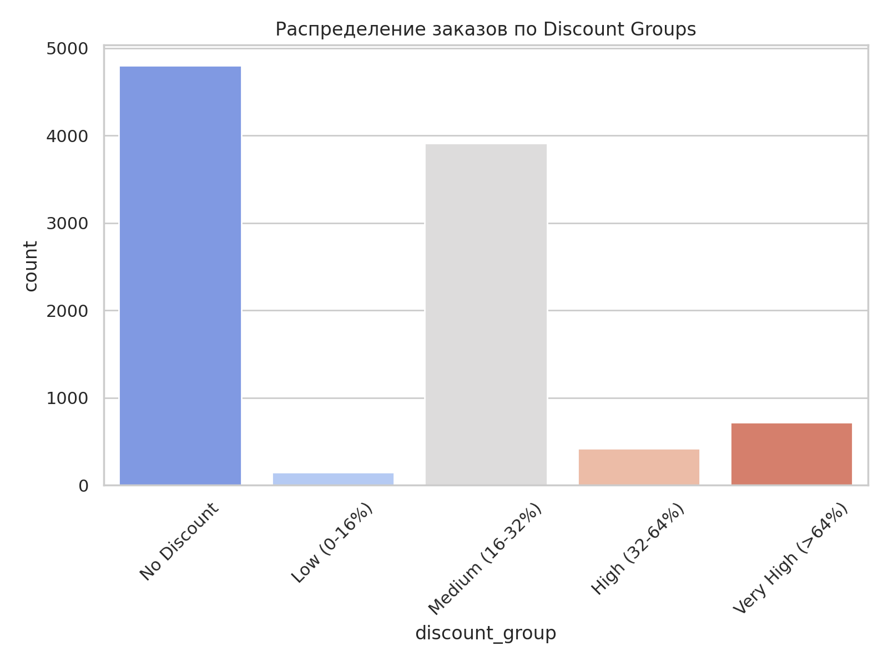
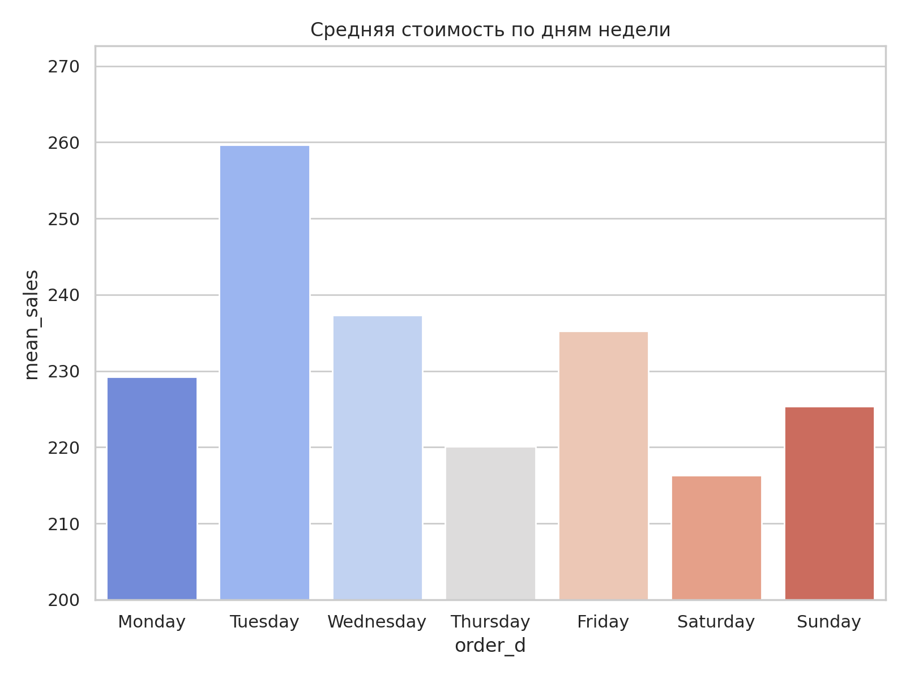
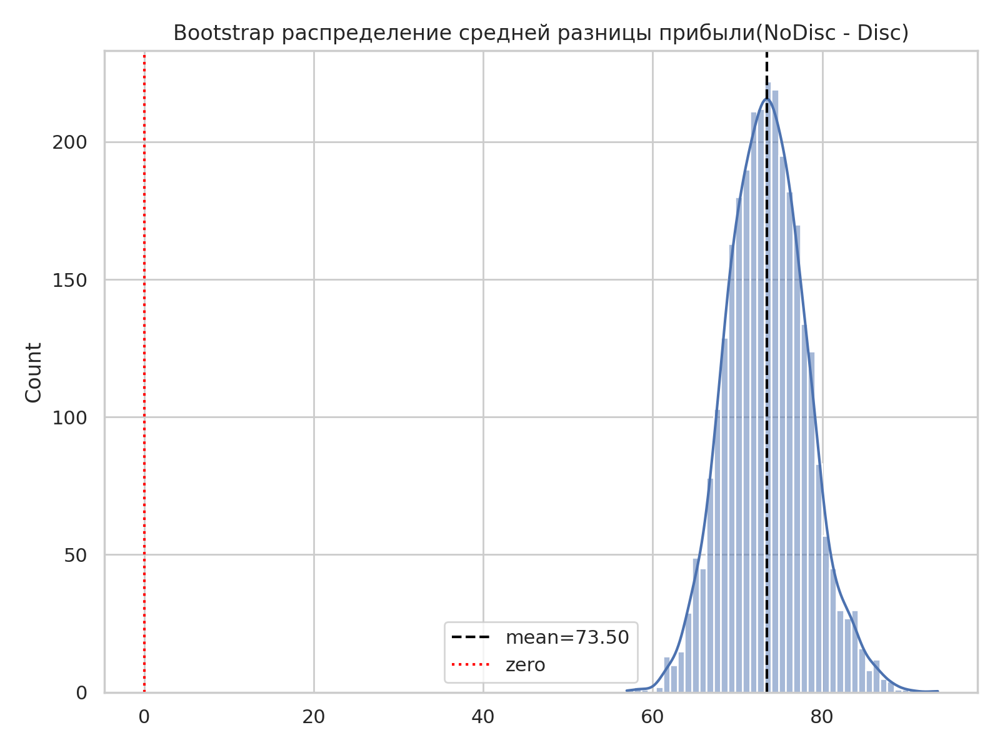

# superstore_marketing_analis

**Цель проекта:**
- Провести маркетинговый анализ продаж (категории, сезонность, KPI).
- Выполнить RFM-анализ для сегментации клиентов.
- Провести A/B-тест по влиянию скидок на прибыль.

**Основные задачи:**
- Анализ структуры и динамики продаж;
- Определение ключевых категорий и продуктов по прибыли;
- Анализ сезонности;
- KPI-аналитика (AOV, margin, discount)
- Проведение RFM-анализа клиентов;
- Проверка гипотезы о влиянии скидок (A/B-тестирование);
- Формулировка рекомендаций по повышению прибыльности.

Все артефакты сохраняются в [`images/`](images/) и [`results/`](results/).
Переход к [**Ноутбуку**](superstore_marketing_analis.ipynb)

---

## Используемые библиотеки
`pandas`, `numpy`, `matplotlib`, `seaborn`, `scipy`, `statsmodels`

---

## 1. Предобработка и обзор данных
- Источник: [**Superstore Dataset**](data/README.md)
- Проверены типы данных, пропуски и дубликаты.  
- Добавлены признаки:
  - `Discount_group` — группы скидок;
  - `order_month`, `order_dow`, `order_week` — календарные признаки;
  - `margin` — отношение прибыли к продажам.

---

## 2. Анализ продаж и прибыли

**Основные результаты:**
- Категории **Technology** и **Office Supplies** приносят наибольшую прибыль.
- Категория **Furniture** менее рентабельна из-за частых и больших скидок.

[Прибыль по категориям](results/top_categories.csv)

| Category        | total_sales | avg_sales          | total_profit | orders | avg_discount        |
|-----------------|-------------|--------------------|--------------|--------|---------------------|
| Technology      | 836154.033  | 452.70927612344343 | 145454.9481  | 1847   | 0.1323226854358419  |
| Office Supplies | 719047.032  | 119.32410089611683 | 122490.8008  | 6026   | 0.15728509790906076 |
| Furniture       | 741999.7953 | 349.8348869872702  | 18451.2728   | 2121   | 0.1739226779820839  |

[Топ-5 продуктов по прибыли](results/top_products.csv)

| Product Name                                                                | Sub-Category | Category        | total_sales        | avg_sales          | total_profit | orders | avg_discount        |
|-----------------------------------------------------------------------------|--------------|-----------------|--------------------|--------------------|--------------|--------|---------------------|
| Canon imageCLASS 2200 Advanced Copier                                       | Copiers      | Technology      | 61599.824          | 12319.96         | 25199.928    | 5      | 0.120 |
| Fellowes PB500 Electric Punch Plastic Comb Binding Machine with Manual Bind | Binders      | Office Supplies | 27453.384 | 2745.34          | 7753.039     | 10     | 0.24                |
| Hewlett Packard LaserJet 3310 Copier                                        | Copiers      | Technology      | 18839.686          | 2354.96         | 6983.8836    | 8      | 0.2                 |
| Canon PC1060 Personal Laser Copier                                          | Copiers      | Technology      | 11619.834 | 2904.96 | 4570.9347    | 4      | 0.150 |
| HP Designjet T520 Inkjet Large Format Printer - 24"" Color                  | Machines     | Technology      | 18374.895          | 6124.97           | 4094.9766    | 3      | 0.167 |

**География и класс доставки**
- Лидеры по суммарной прибыли: штаты **California**, **New York**, **Washington**; регионы — West / East.  
- **Standard Class** — самый часто используемый способ доставки, дающий наибольший вклад в выручку (по объёму заказов).

**Распределение заказов по Discount Groups:**
Значительная часть заказов имеют скидки, и их распределение по группам (Low, Medium, High, Very High) неоднородно.

---

## 3. Сезонность и тренды
- Продажи растут к IV кварталу (октябрь–декабрь);
- Снижение активности наблюдается в летние месяцы;

**Помесячная агрегация стоимости и прибыли:**

- По дням недели: пик продаж — будни, спад — выходные.

**Средняя стоимость по дням недели:**
  

- Для проверки тренда/стационарности выполнен ADF-тест на месячном ряду (в ноутбуке выводится p-value). Декомпозиция и визуализация подтверждают выраженную сезонность — пик продаж наблюдается в ноябре-декабре.

---

## 4. KPI-аналитика

**Метрики:**
- mean_AOV - Средний чек (Sales / Orders)
- mean_margin - Рентабельность (Profit / Sales)
- mean_discount - Средний уровень скидки
- total_profit - Суммарная прибыль на заказ
- total_sales - Суммарная стоимость заказа

[KPI по категориям](kpi_by_category.csv)

| Category        | total_sales | total_profit | mean_discount       | mean_AOV           | mean_margin         |
|-----------------|-------------|--------------|---------------------|--------------------|---------------------|
| Technology      | 836154.033  | 145454.9481  | 0.1323226854358419  | 120.38935462912832 | 0.15613805312776619 |
| Office Supplies | 719047.032  | 122490.8008  | 0.15728509790906076 | 32.15557816130103  | 0.1380302946491131  |
| Furniture       | 741999.7953 | 18451.2728   | 0.1739226779820839  | 90.85408821310703  | 0.0387835332152663  |

Категории с высокой средней скидкой (в т.ч. Furniture) показывают более низкую среднюю маржу.

**Срденяя скидка и маржа по категориям:**

**Вывод:** увеличение скидки выше 30 % приводит к снижению маржи без значимого роста выручки.

---

## 5. RFM-анализ клиентов

- **Recency (R)** — давность последней покупки;  
- **Frequency (F)** — частота заказов;  
- **Monetary (M)** — общая сумма продаж.

[Расчёт RFM для каждого клиента](rfm_base.csv)

| Customer ID | Recency | Frequency | Monetary |
|-------------|---------|-----------|----------|
| AA-10315    | 185     | 5         | 5563.56  |
| AA-10375    | 20      | 9         | 1056.39  |
| AA-10480    | 260     | 4         | 1790.512 |

Клиенты разделены на квартильные группы (1–4).  
Объединены в сегменты для оценки ценности и лояльности.
Примеры сегментов:
- `R=4, F=4, M=4` — лояльные и ценные клиенты (VIP);
- `R=1, F=1, M=1` — неактивные клиенты.

[Топ 5 RFM_Score по количеству клиентов](rfm_summary.csv)

| RFM_Score | customers | avg_recency        | avg_frequency      | avg_monetary       | total_profit       | mean_profit        | total_sales | mean_sales         |
|-----------|-----------|--------------------|--------------------|--------------------|--------------------|--------------------|-------------|--------------------|
| 111       | 55        | 490.58 | 2.84 | 500.26 | 232.89 | 2.28 | 27514.0837  | 95.69  |
| 444       | 34        | 16.0               | 10.09 | 5863.65  | 27244.07         | 42.89  | 199364 | 294.24  |
| 112       | 26        | 482.69  | 3.19 | 1617.69 | 2086.15          | 2.51 | 42059.95  | 292.13 |
| 344       | 24        | 49.0               | 10.08 | 6603.38 | 21781.82          | 43.43  | 158481.06 | 302.53  |
| 443       | 24        | 17.83 | 9.83  | 2847.37  | 3390.11          | 5.57   | 68336.94  | 147.21  |

**Распределение суммарного RFM-счёта:**

**Вывод:** RFM-сегментация, дополненная анализом прибыли, четко выделяет прибыльные и убыточные сегменты клиентов. Анализ подтверждает важность удержания и развития отношений с высокоприбыльными сегментами и могут служить основой для разработки целенаправленных маркетинговых стратегий.

---

## 6. A/B-анализ скидок

**Гипотеза H₀:** скидка не влияет на прибыль.  
**Гипотеза H₁:** наличие скидки снижает прибыль.

**Группы:**
- **A** — заказы без скидки (`discount_flag == 0`)
- **B** — заказы со скидкой (`discount_flag == 1`)

[Агрегация по группам скидок](ab_agg.csv):

| discount_flag | orders | mean_profit        | median_profit | mean_sales         | mean_AOV          |
|---------------|--------|--------------------|---------------|--------------------|-------------------|
| 0             | 4798   | 66.90029245518967  | 15.9952       | 226.74207378074198 | 58.90504168403502 |
| 1             | 5196   | -6.657155792917629 | 3.3408        | 232.73525602386454 | 62.77978889530408 |

**Визуализация сравнения mean profit:**

**Распределение прибыли (boxplot, 1–99%):**

**Статистические тесты:**

1. **Тест Шапиро-Уилка** на нормальность: обе выборки показали p < 0.05, а значит распределения не нормальны.  
2. **Mann-Whitney U-test** (непараметрический) — применён из-за ненормальности; p < 0.05, следовательно статистически значимая разница между группами.  
3. **Бутстрап разницы средних:** реализована бутстрап-оценка и построено распределение разницы средних (NoDisc − Disc):
   - Вычислены: `mean_diff` и 95% CI; 
   - Построена **Гистограмма bootstrap распределения:**

---

**Регрессионный анализ**

Модель:  
`Profit ~ Discount_group + Sales + Quantity + C(Category) + C(Region)`

- Коэффициент при `discount_flag` (эффект скидки при прочих равных) — **−71.3159**, p < 0.05 (как указано в выводе ячейки регрессии).

[Таблица коэффициентов](regression_coefficients.csv)

|                                | Coef.                 | Std.Err.             | t                     | P>\|t\|                  | [0.025             |      0.975]         |
|--------------------------------|-----------------------|----------------------|-----------------------|------------------------|---------------------|---------------------|
| Intercept                      | 0.11    | 7.33     | 0.0147  | 0.988     | -14.25 | 14.47  |
| C(Category)[T.Office Supplies] | 45.68     | 5.17    | 8.83      | 1.18e-18 | 35.54   | 55.81  |
| C(Category)[T.Technology]      | 46.81     | 6.42    | 7.29     | 3.308e-13 | 34.23   | 59.4   |
| C(Region)[T.East]              | -0.026 | 5.66   | -0.00467 | 0.996      | -11.13 | 11.075   |
| C(Region)[T.South]             | -2.996   | 6.54   | -0.458    | 0.647     | -15.82  | 9.83   |
| C(Region)[T.West]              | 2.77     | 5.54    | 0.501    | 0.616       | -8.079  | 13.63   |
| discount_flag                  | -71.32    | 4.09    | -17.423   | 5.4e-67 | -79.34  | -63.29  |
| Sales                          | 0.19   | 0.00339 | 54.81    | 0.0                    | 0.18 | 0.19  |
| Quantity                       | -3.61   | 0.925   | -3.8995  | 9.7004e-05  | -5.42  | -1.79 |

**Интерпретация:** при прочих равных условиях наличие скидки в среднем связано со снижением прибыли на ≈ 71 (единиц прибыли на заказ) в данной модели.

---

**Сегментный анализ и множественные гипотезы**

Группировка скидок по уровню: `No Discount`, `Low (0–16%)`, `Medium (16–32%)`, `High (32–64%)`, `Very High (>64%)`.

[Попарные тесты для групп скидок против группы без скидки](pairwise_discount_group_tests.csv)

| group_vs_no_discount            | mean_no_discount  | mean_group          | t_stat               | p_value                | n_group | p_value_adj            | reject_H0 |
|---------------------------------|-------------------|---------------------|----------------------|------------------------|---------|------------------------|-----------|
| Low (0-16%) vs No Discount      | 66.90029245518967 | 71.56279794520547   | -0.45618177735211063 | 0.6487741813313813     | 146     | 0.6487741813313813     | False     |
| Medium (16-32%) vs No Discount  | 66.90029245518967 | 19.83556402454615   | 11.325961205200443   | 1.7617165841183309e-29 | 3911    | 3.5234331682366617e-29 | True      |
| High (32-64%) vs No Discount    | 66.90029245518967 | -123.51839619952494 | 12.999256471582509   | 2.6217877740884434e-33 | 421     | 1.0487151096353774e-32 | True      |
| Very High (>64%) vs No Discount | 66.90029245518967 | -98.34874108635097  | 10.882650376996926   | 7.722721732642438e-26  | 718     | 1.0296962310189918e-25 | True      |

**Вывод:** После FDR-коррекции выявлено: **low (0–16%) не отличается от No Discount** (adj p > 0.05), тогда как средние и большие скидки имеют статистически значимое негативное влияние на среднюю прибыль.

---

**Power-анализ и симуляция эксперимента**

- Power-анализ с помощью `TTestIndPower` показывает требуемый размер выборки для обнаружения эффекта d = 0.3.
- Реализована ффункция (function `solve_power`) из которой следует, что необходимо минимум **175 наблюдений в каждой группе** при α = 0.05 и power = 0.8.

**Вывод:** Выборки имеют достаточный разммер.

---

## 7. Основные выводы и рекомендации

1. **Маркетинговый анализ:**
   - Наибольшую прибыль приносят категории Technology и Office Supplies;
   - Топ-продукты - это в основном дорогостоящие товары из категории Technology;
   - Основные центры прибыли находятся в штатах Калифорния и Нью-Йорк, а также в Западном и Восточном регионах.
2. **Сезонность:**
   - Обнаружена сезонность с пиковой активностью в 4-ом квартале;
   - Выявлен восходящий тренд в продажах и прибыли.
3. **RFM-сегментация:**
   - Ценные VIP-клиенты формируют существенную долю прибыли при небольшой доле клиентов;
   - Выявлены несколько основных сегментов клиентов:  ВИПы, Активные, Под угрозой оттока, Новые и Спящие клиенты.
4. **A/B-тест скидок:**
   - Скидки, особенно на уровнях выше 16%, статистически значимо и негативно влияют на прибыль;
   - Низкие скидки (0–16%) не показали статистически значимого негативного эффекта, их стоит изучить подробнее.

**Рекомендации:**
- Сократить скидки > 30 %, тестировать небольшие скидки на отдельных сегментах;
- Использвать индивидуальный подход к клиентам на основе RFM-анализа;
- Развивать ключевые регионы и города.
