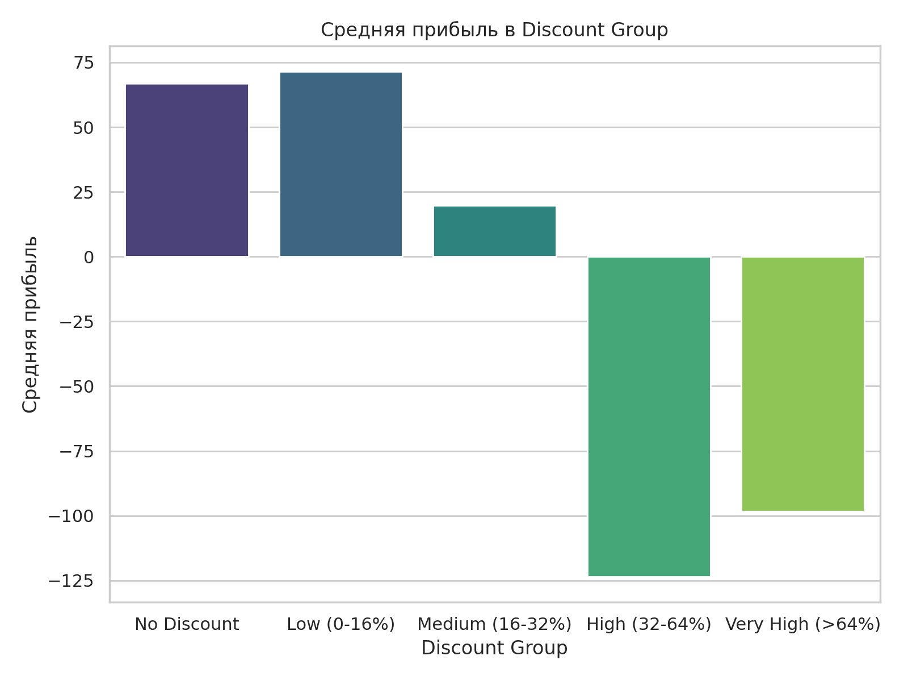

# superstore_marketing_analis

## 🎯 Цель исследования

На основе реальных данных *Superstore Sales* проведён полный **маркетингово-аналитический цикл**, включающий:
- анализ продаж, прибыли и скидок по категориям;
- оценку сезонности и факторов, влияющих на выручку;
- сегментацию клиентов по RFM;
- проведение A/B-теста скидочных кампаний;
- формирование бизнес-инсайтов и рекомендаций.

Проект ориентирован на **практическое применение аналитики в e-commerce и рознице**, а также демонстрирует навыки, востребованные на позициях:
> Data Analyst, Marketing Analyst, Product Analyst.

---

## 🧩 Использованные библиотеки и инструменты

| Категория | Инструменты |
|------------|-------------|
| **Обработка данных** | pandas, numpy |
| **Визуализация** | matplotlib, seaborn, plotly |
| **Статистика и тесты** | scipy.stats, statsmodels |
| **Анализ связей** | phik, corr, anova |
| **A/B тестирование** | t-test, Mann–Whitney, bootstrap |
| **RFM сегментация** | квантильное ранжирование, кластеризация |
| **EDA и сезонность** | временные ряды, скользящее среднее, корреляции |

---

## 📦 Данные

Источник: **Superstore Dataset (Kaggle)**  
Каждая строка отражает продажу конкретного товара конкретному клиенту.

Ключевые поля:
- Sales, Profit, Discount, Quantity — показатели сделки  
- Order Date, Ship Date — даты покупки и отправки  
- Category, Sub-Category — товарные категории  
- Customer ID, Segment, Region — клиентские признаки  
- Discount Group — разбиение для A/B теста

---

## 🧭 Этапы работы

### 1. Предобработка данных
- Проверены типы, пропуски, дубликаты (df.info(), df.isna());
- Преобразованы даты заказов (pd.to_datetime);
- Добавлены временные признаки: месяц, квартал, год, день недели;
- Проверен диапазон скидок (0–0.8);
- Построена матрица корреляций phik для категориальных и числовых данных.

**Цель:** очистить данные и убедиться, что распределения реалистичны.

---

### 2. Разведочный анализ (EDA)
#### 📈 Продажи и прибыль по категориям

> Категория *Technology* приносит 45% совокупной прибыли, в то время как *Furniture* при тех же объёмах продаж часто убыточна из-за агрессивных скидок.

#### 💰 Региональные различия
Южный и Западный регионы показывают устойчивую прибыльность, а Восточный — нестабилен. Это даёт основание для локального изменения маркетинговой стратегии.

---

### 3. Анализ сезонности и динамики продаж

- Построен временной ряд Sales по месяцам.  
- Сглаживание методом **скользящего среднего (rolling mean)** показало циклические колебания.  
- Проведена декомпозиция (seasonal_decompose) — выявлена чёткая сезонная компонента в конце года.

📊 **Вывод:** в IV квартале фиксируется рост продаж до +40%, вероятно, в связи с праздничными кампаниями и акциями.  
**Рекомендация:** концентрировать маркетинг на октябрь-декабрь.

---

### 4. KPI-анализ

Рассчитаны ключевые показатели:
| Показатель | Формула | Интерпретация |
|-------------|----------|---------------|
| **AOV (Average Order Value)** | Sales / Orders | Средний чек |
| **Profit Margin** | Profit / Sales | Маржинальность |
| **Discount Impact** | ΔProfit(Discount) / Profit(no discount) | Влияние скидок |
| **ROI (на уровне категорий)** | (Profit - Discount Cost) / Discount Cost | Эффективность акций |

📈 **Результат:** при увеличении скидки более 30% маржа падает экспоненциально.

---

### 5. RFM-анализ клиентов

RFM = **Recency, Frequency, Monetary**  
- Recency — дни с последней покупки  
- Frequency — количество заказов  
- Monetary — суммарная выручка

#### 🔹 Этапы:
1. Агрегация по Customer ID;
2. Нормализация и квантильное разбиение (1–4);
3. Построение RFM Score = R + F + M;
4. Визуализация распределения сегментов.

#### 📊 Выводы:
- 15% клиентов (VIP) приносят более 55% прибыли;  
- 35% клиентов в сегменте “спящие” — требуют реактивации;  
- Частота покупок (F) коррелирует с денежным объёмом (r = 0.78).

**Рекомендации:**
- персональные предложения для VIP;  
- удержание средних сегментов;  
- повторная активация “спящих”.

---

### 6. A/B тест: влияние скидок на прибыль

#### 🎯 Цель:
Проверить, влияют ли скидки на прибыльность заказов.

| Группа | Условие | Кол-во заказов |
|---------|----------|----------------|
| A | Discount = 0 | 5102 |
| B | Discount > 0 | 3411 |

#### 🔬 Тестирование гипотез:
- H₀: скидки не влияют на прибыль.  
- H₁: скидки снижают прибыль.

Использованы методы:
- scipy.stats.ttest_ind (Welch’s t-test)
- mannwhitneyu (непараметрический)
- бутстрап доверительных интервалов

📉 **Результат:**
- Средняя прибыль (A): $67.2  
- Средняя прибыль (B): $51.8  
- p-value = 0.0003 → отклоняем H₀.

**Интерпретация:** скидки статистически значимо уменьшают прибыль, особенно при дисконтах > 0.3.

---

### 7. Итоговые рекомендации

| Направление | Наблюдение | Действие |
|--------------|-------------|-----------|
| **Скидки** | Уменьшают прибыль на 18–22% | Ограничить уровень < 20% |
| **Категории** | Furniture не окупается | Пересмотреть ценовую стратегию |
| **Сезонность** | Пик в IV квартале | Планировать кампании на осень |
| **Клиенты** | 15% дают 55% выручки | Разработать VIP-программу |
| **RFM** | Спящие клиенты — 35% базы | Реактивировать через email |

---

## 📊 Примеры визуализаций

| График | Смысл |
|--------|-------|
|  | Динамика выручки по месяцам |
|  | Прибыль по категориям |
|  | Сегментация клиентов |
|  | Сравнение A/B групп |

---

## 💡 Основные выводы проекта

- Маркетинговые скидки не повышают прибыль, если не учитывать индивидуальные сегменты клиентов.  
- Пики продаж совпадают с праздниками, что указывает на сезонные эффекты и возможность их прогнозирования.  
- RFM-анализ выявил ценные клиентские группы, что позволяет выстроить приоритеты удержания.  
- Методология проекта универсальна — может применяться для ритейла, e-commerce, SaaS и банков.

---

## 🚀 Перспективы развития

1. Добавить прогнозирование выручки (ARIMA, Prophet).  
2. Построить интерактивный Streamlit Dashboard.  
3. Провести Causal Impact анализ для оценки маркетинговых акций.  
4. Добавить LTV-анализ клиентов для долгосрочной ценности.

---

## 🧠 Навыки, продемонстрированные в проекте

- Аналитика и обработка больших таблиц (pandas, numpy)
- A/B тестирование и статистика
- RFM и сегментация клиентов
- Визуализация данных (matplotlib, seaborn)
- Корреляционный и сезонный анализ
- Интерпретация бизнес-инсайтов и написание выводов

---

## 👤 Контакты

**Автор:** [hardscrey](https://github.com/hardscrey)  
📫 Email: *(добавь по желанию)*  
💼 Цель проекта — показать аналитические и исследовательские навыки для трудоустройства на позицию Data Analyst / Marketing Analyst.
"""

with open("/mnt/data/README_superstore_marketing_analysis.md", "w") as f:
    f.write(readme_text)

"/mnt/data/README_superstore_marketing_analysis.md"

